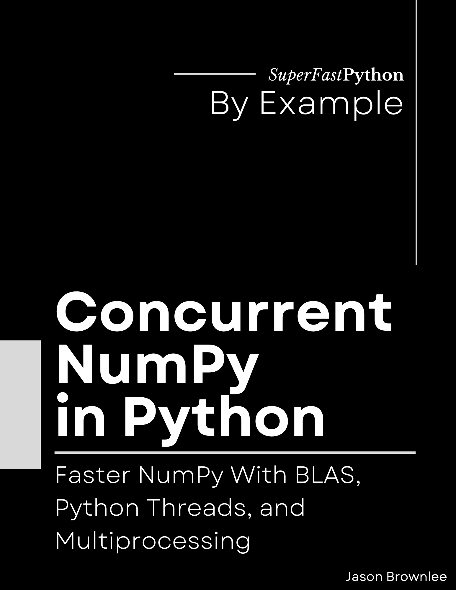

# Concurrent NumPy in Python

* <https://github.com/SuperFastPython/ConcurrentNumPyInPython>

This repository provides all source code for the book:

* **Concurrent NumPy in Python**: _Faster NumPy With BLAS, Python Threads, and Multiprocessing_, Jason Brownlee, 2023.

## Source Code
You can access all Python .py files directly here:

* [src/](src/)

## Get the Book

You can learn more about the book here:

* Coming soon...

### Book Blurb

> Concurrency in NumPy was not an afterthought, but using the wrong type can be fatal.
>
> * Discover matrix multiplication that is 2.7x faster.
> * Discover array initialization that is up to 3.2x faster.
> * Discover sharing copied arrays that is up to 516.91x faster.
>
> NumPy is how we represent arrays of numbers in Python.
>
> An entire ecosystem of third-party libraries has been developed around NumPy arrays, from machine learning and deep learning to image and computer vision and more.
>
> Given the wide use of NumPy, it is essential we know how to get the most out of our system when using it.
>
> We cannot afford to have CPU cores sit idle when performing mathematical operations on arrays.
>
> Therefore we must know how to correctly harness concurrency in NumPy, such as:
>
> * NumPy has multithreaded algorithms and functions built-in (using BLAS).
> * NumPy will release the infamous GIL so Python threads can run in parallel.
> * NumPy arrays can be shared efficiently between Python processes using shared memory.
>
> The problem is, no one is talking about how.
>
> Introducing: "Concurrent NumPy in Python". A new book designed to teach you how to bring concurrency to your NumPy programs in Python, super fast!
>
> You will get fast-paced tutorials showing you how to bring concurrency to the most common NumPy tasks.
>
> Including:
>
> * Parallel array multiplication, common math functions, matrix solvers, and decompositions.
> * Parallel array filling and parallel creation of arrays of random numbers.
> * Parallel element-wise array arithmetic and common array math functions
> * Parallel programs for working with many NumPy arrays with thread and process pools.
> * Efficiently share arrays directly, and copies of arrays between Python processes.
>
> Don't worry if you are new to NumPy programming or concurrency, you will also get primers on the background required to get the most out of this book, including:
>
> * The importance of concurrency when using NumPy and the cost of approaching it naively.
> * How to perform common NumPy operations and math functions.
> * How to install, query, and configure BLAS libraries for built-in multithreaded NumPy functions.
> * How to use Python concurrency APIs including threading, multiprocessing, and pools of workers.
>
> Each tutorial is carefully designed to teach one critical aspect of how to bring concurrency to your NumPy projects.
>
> Learn Python concurrency correctly, step-by-step.

